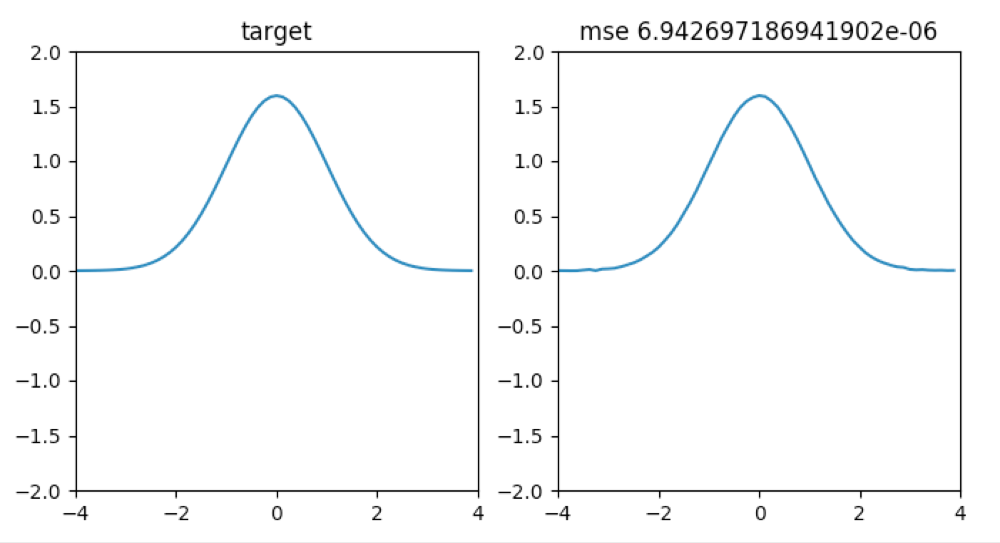

# Genetic Algorithm

Use Genetic Algorithm to fit Gaussian Curve, pretty good, yeah?

## Key Points

- Random initialization and keep fixed size of population.
- Select member with highest adaptation score, survive, and propagate.
- Gene(data) changes with small probability.
